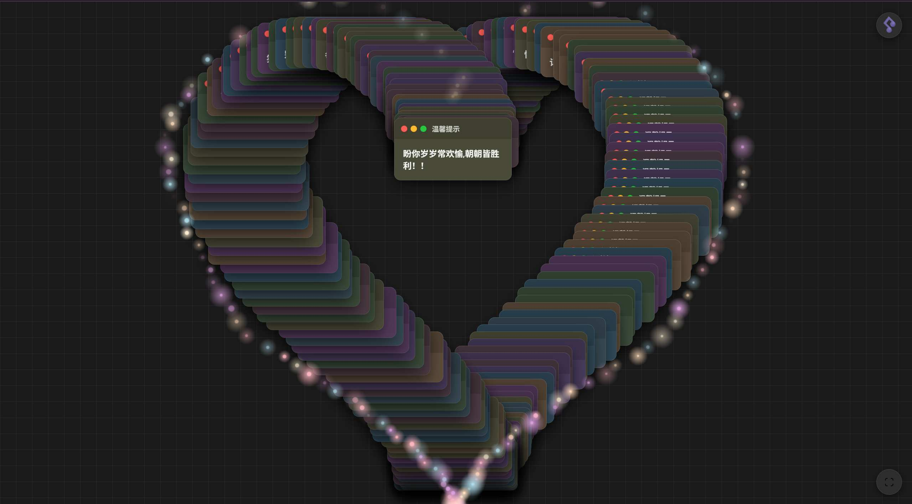

# Heart Notes

一个温馨的爱心便签墙，99张彩色便签组成爱心形状。

## 项目预览



## 特性

- 99张便签排列成爱心形状
- 粒子光环动画效果
- 支持拖拽、全屏、最小化
- 深色/浅色主题切换
- 背景音乐播放
- 响应式设计
- 70多条温馨文案

## 技术栈

- Vanilla JavaScript (ES6)
- CSS3
- Canvas

## 本地运行

```bash
# 使用Python
python -m http.server 4000

# 或使用Node.js
npx http-server -p 4000
```

访问 `http://localhost:4000`

## 项目结构

```
Heart-Notes/
├── index.html
├── public/
│   ├── favicon.ico
│   └── music.mp3
├── css/
│   └── styles.css
└── js/
    ├── app.js
    ├── cardManager.js
    ├── particleEffect.js
    ├── audioManager.js
    ├── musicControlManager.js
    ├── themeManager.js
    ├── fullscreenManager.js
    ├── stateManager.js
    ├── config.js
    └── utils.js
```

## 配置

可在 `js/config.js` 中自定义卡片数量、动画参数、文案内容等。

